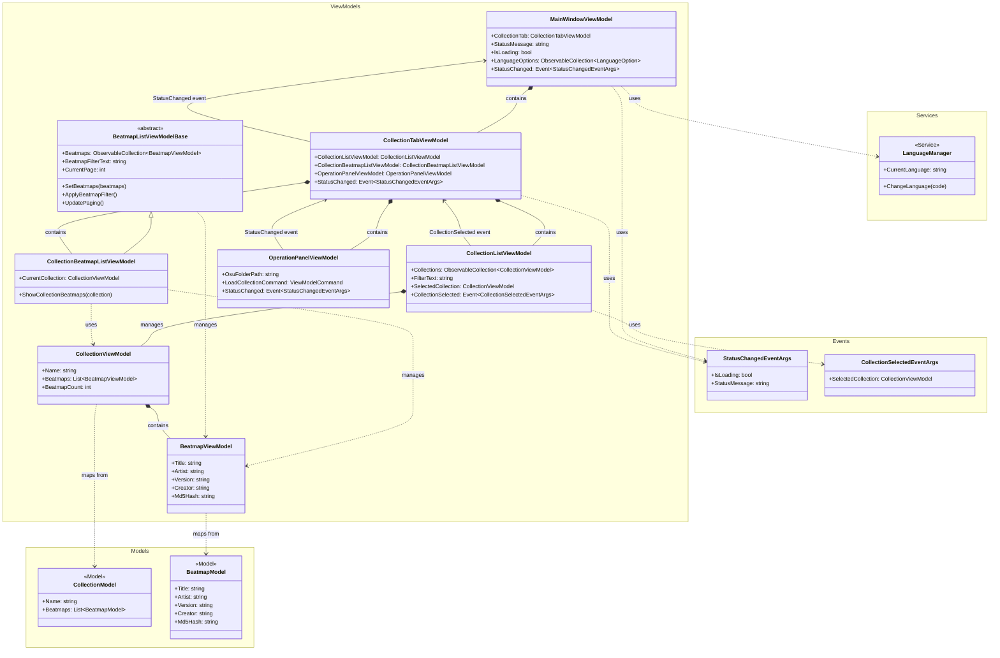

# NakuruTool アーキテクチャ概要

## 概要
このドキュメントは、NakuruTool（osu! collection管理ツール）のアーキテクチャ設計とクラス間の依存関係を図示します。

## クラス図



## 🔍 依存関係の評価結果

### ✅ **良好な設計パターン**

1. **適切な継承階層**
   - `BeatmapListViewModelBase` → `CollectionBeatmapListViewModel`
   - 共通機能（ページング、フィルタリング）を基底クラスで提供

2. **イベント駆動通信**
   - 直接参照ではなくイベントで疎結合を実現
   - `CollectionSelected`, `StatusChanged` イベントによる通信

3. **単一責任原則**
   - 各ViewModelが明確な役割を持つ
   - `CollectionListViewModel`: コレクション一覧管理
   - `CollectionBeatmapListViewModel`: 選択コレクションのビートマップ表示
   - `CollectionTabViewModel`: タブ全体の統合管理

4. **階層的構造**
   - MainWindow → Tab → 個別ViewModel の明確な階層
   - 責務の階層分離により保守性向上

### ⚠️ **要注意ポイント**

#### 1. **CollectionSelectedEventArgs の密結合問題**

**現状の問題**
```csharp
// CollectionListViewModel.cs 内部で定義
public class CollectionSelectedEventArgs : EventArgs
{
    public CollectionViewModel SelectedCollection { get; }
    // ...
}
```

**問題の詳細**
- `CollectionSelectedEventArgs` が `CollectionListViewModel.cs` の内部クラスとして定義されている
- `CollectionTabViewModel` でこのイベントを処理する際、以下の依存関係が発生：
  ```csharp
  // CollectionTabViewModel.cs 内
  private void OnCollectionSelected(object sender, CollectionListViewModel.CollectionSelectedEventArgs e)
  {
      // CollectionListViewModel.CollectionSelectedEventArgs への直接参照
  }
  ```

**影響範囲**
- **コンパイル時依存**: CollectionTabViewModelがCollectionListViewModelクラス全体に依存
- **保守性の低下**: CollectionListViewModelの変更がイベント処理側にも影響する可能性
- **再利用性の制限**: 他のViewModelで同様のイベントを使いたい場合、同じ依存が発生
- **テスト複雑化**: イベントのテスト時にCollectionListViewModel全体をモックする必要

**推奨改善案**
```csharp
// Events/CollectionSelectedEventArgs.cs として分離
namespace NakuruTool.ViewModels.Events
{
    public class CollectionSelectedEventArgs : EventArgs
    {
        public CollectionViewModel SelectedCollection { get; }
        // ...
    }
}
```

**改善後の利点**
- イベント処理側は純粋にEventArgsクラスのみに依存
- CollectionListViewModelの内部実装変更がイベント処理に影響しない
- 他のViewModelでも同じEventArgsを再利用可能

#### 2. **型エイリアス依存による名前空間競合**

**現状のコード**
```csharp
// BeatmapViewModel.cs
using Livet;
using BeatmapModel = NakuruTool.Models.Collection.Beatmap;

namespace NakuruTool.ViewModels.Beatmap
{
    public class BeatmapViewModel : ViewModel
    {
        // BeatmapModel を使用してModel層のBeatmapクラスを参照
    }
}
```

**問題の詳細**
- `NakuruTool.ViewModels.Beatmap` 名前空間に `BeatmapViewModel` が存在
- `NakuruTool.Models.Collection.Beatmap` クラスを参照したいが、名前が競合
- 型エイリアス `BeatmapModel = NakuruTool.Models.Collection.Beatmap` で解決

**技術的な問題点**
- **暗黙的依存**: エイリアスにより依存関係が隠蔽される
- **IDE支援の制限**: IntelliSenseで型名からの逆引きが困難
- **リファクタリング制約**: 自動リファクタリングツールが依存関係を正しく追跡できない場合がある
- **新規開発者の理解コスト**: コードを読む際にエイリアスの解決が必要

**発生原因**
1. **名前空間設計**: `BeatmapViewModel` を `Beatmap` 名前空間に配置
2. **Model命名**: Model層の `Beatmap` クラス名との競合
3. **名前空間構造**: 階層が深く、同名クラスが複数存在

**代替解決案の比較**

**案1: 現状維持（型エイリアス使用）**
```csharp
using BeatmapModel = NakuruTool.Models.Collection.Beatmap;
```
- ✅ 短期的な解決
- ❌ 長期的な保守性に課題

**案2: フルネーム使用**
```csharp
private NakuruTool.Models.Collection.Beatmap ConvertToModel()
```
- ✅ 明示的な依存関係
- ❌ コードの冗長化

**案3: 名前空間再設計**
```csharp
// ViewModels.CollectionManagement.BeatmapViewModel
// Models.Data.Beatmap
```
- ✅ 根本的解決
- ❌ 大規模なリファクタリングが必要

**推奨対応**
- **短期**: 現状の型エイリアスを維持（動作に問題なし）
- **中期**: コメントで依存関係を明示
- **長期**: 名前空間設計の見直しを検討

**コメント例**
```csharp
// 型エイリアス: Models層のBeatmapクラスとの名前競合を回避
// NakuruTool.Models.Collection.Beatmap → BeatmapModel
using BeatmapModel = NakuruTool.Models.Collection.Beatmap;
```

### 🎯 **アーキテクチャの強み**

1. **拡張性**
   - 新しいタブ（全曲リストなど）の追加が容易
   - TabViewModelパターンにより統一的な拡張が可能

2. **保守性**
   - 責務分離により個別コンポーネントの修正が独立
   - MVVMパターンの適切な実装

3. **テスト容易性**
   - 各ViewModelを個別にテスト可能
   - イベント駆動により依存関係が明確

4. **MVVM準拠**
   - Livetフレームワークを適切に活用
   - プロパティ変更通知の統一実装

## 📁 ファイル構成

### ViewModels構成
```
NakuruTool.ViewModels/
├── MainWindowViewModel.cs              # メイン画面統合管理
├── Tabs/
│   └── CollectionTabViewModel.cs       # コレクションタブ統合管理
├── Collection/
│   ├── CollectionListViewModel.cs      # コレクション一覧
│   ├── CollectionBeatmapListViewModel.cs # 選択コレクション内ビートマップ
│   ├── CollectionViewModel.cs          # コレクション表現
│   └── OperationPanelViewModel.cs      # 操作パネル
├── Beatmap/
│   ├── BeatmapListViewModelBase.cs     # ビートマップリスト共通基底
│   └── BeatmapViewModel.cs             # ビートマップ表現
└── Events/
    └── StatusChangedEventArgs.cs       # ステータス変更イベント
```

### 設計パターン

1. **Abstract Factory Pattern**
   - `BeatmapListViewModelBase` による共通機能提供

2. **Observer Pattern**
   - イベントによる ViewModel 間通信

3. **Composite Pattern**
   - タブ内での複数ViewModel統合管理

4. **MVVM Pattern**
   - Livetフレームワークによる適切な実装

## 🚀 将来の拡張性

### 新機能追加時の拡張ポイント

1. **新しいタブ追加** (例: 全曲リストタブ)
   ```
   - AllSongsTabViewModel 作成
   - AllSongsBeatmapListViewModel 作成 (BeatmapListViewModelBase継承)
   - MainWindowViewModel にタブ追加
   ```

2. **新しいリスト表示機能**
   ```
   - BeatmapListViewModelBase を継承
   - 既存のページング・フィルタリング機能を自動継承
   ```

3. **新しいイベント通信**
   ```
   - Events名前空間にEventArgs追加
   - イベント駆動による疎結合な機能連携
   ```

## ✅ **最終決定: PropertyChanged統一方式**

### **2025-08-03 設計方針の最終確定**

#### **EventArgs方式からPropertyChanged統一への方針転換**

**決定理由**:
- **一貫性**: 複数の通信方式による混乱を回避
- **WPF標準準拠**: MVVMパターンの確立された実装方式
- **保守性**: 統一されたパターンによる理解容易性
- **型安全性**: `nameof()` によるコンパイル時型チェック

#### **PropertyChanged統一方式の最終実装**

**基本方針**:
```csharp
// 全ての ViewModel間通信で PropertyChanged を使用
private void OnViewModelPropertyChanged(object sender, PropertyChangedEventArgs e)
{
    if (e.PropertyName == nameof(TargetViewModel.PropertyName))
    {
        HandlePropertyChange();
    }
}
```

**統一されたパターン**:
- ✅ switch文または配列による効率的な複数プロパティ監視

#### **設計の最終成果**

**通信方式統一**:
- View ↔ ViewModel: PropertyChanged
- ViewModel ↔ ViewModel: PropertyChanged

**一貫性達成**:
- 新規開発者の学習コスト削減
- チーム内での統一されたコーディングスタイル
- WPF標準パターンとの完全整合